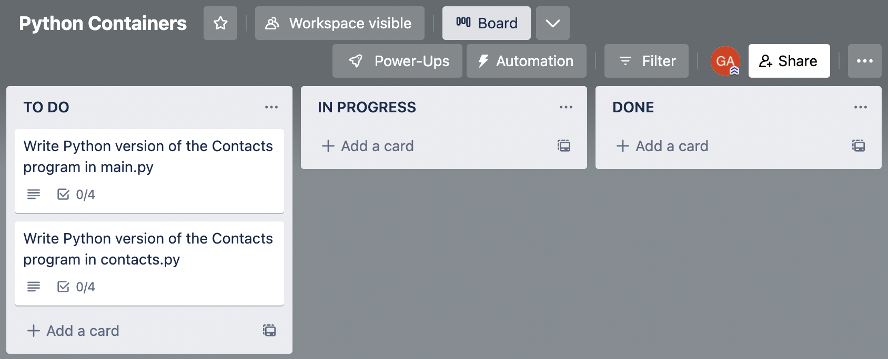

<!--  -->
# Python Containers - Work Based Problem


Y Language fever has gripped the city! Hot on the heels of Triangle announcing their decision to switch to Y Language, ***ROS - Retro Operating Systems*** has announced the same thing!

<!-- Remember the **Contacts** program you helped write, what seems like a long, long time ago?

Now you'll be rewriting the **Contacts** program into Y Language.

Good luck! -->

(In this exercise, X = Javascript and Y = Python. So you'll be rewriting a program originally written in Javascript into Python!)


- Write Python version of the Contacts program in main.py
- Write Python version of the Contacts program in contacts.py 
- Use basic Python syntax including:
  - List `[]` syntax
  - Dictionary `{}` syntax
  - Iterating through lists
  - Appending and Removing items from lists
  - `while` loops
  - `match` statement (same as `switch` in Javascript)
  - String interpolation using `f`-strings
  - And everything else from the previous problem!


<!-- [Trello Board](https://trello.com/b/gndzk6Iz/python-containers) -->




#### Step 1:

- Fork and clone [this](https://git.generalassemb.ly/SEI-Standard-Curriculum/M4L3-python-containers-wbp) repository
- Navigate (`cd`) into the repository folder in your console
- Open up the repository folder in your code editor
  - If you're using Visual Studio Code, the command is `code .`
- In your terminal, navigate into the `js` directory -- this directory contains the working Javascript program
  - Run the command `npm install` -- this will install the modules necessary for the automated tests to run
- Run the automated tests with `npm test`. You should see:
```
  % npm test

  > python-containers-wbp@0.0.0 test
  > jest

   PASS  test/contacts.test.js
   PASS  test/main.test.js

  Test Suites: 2 passed, 2 total
  Tests:       10 passed, 10 total
  Snapshots:   0 total
  Time:        0.18 s, estimated 1 s
  Ran all test suites.
  ```
- Open up `js/src/main.js` and `js/src/contacts.js`. These files contain the working **Contacts** program in Javascript
  <!-- - You'll recall that you worked on this before! The new addition here is the implementation of the `deleteContact()` function, which previously was not yet implemented -->
  - Read it over and understand it -- it should be simple for you at this stage of the game!
- Run the program with `node src/main.js`. Play with it and understand its operation
- You do not need to touch anything in the `js/test` directory; those are the automated tests

#### Step 2:

- Now, open up `python/src/main.py` and `python/src/contacts.py`
- You'll be writing the Python version of the Contacts program in these two files
- To run the program, navigate to the `python` directory in your terminal and run  `python src/main.py`
  - Build your program up bit by bit and make sure it runs correctly! Run it often!
- You do not need to touch anything in the `python/test` directory; those are the automated tests

#### Step 3:

- First, write `python/src/main.py`
- Open up `js/src/main.js` and `python/src/main.py` side by side, and translate the code line-by-line
  - You should stay as faithful as you can to the original Javascript, and try to figure out the exact Python equivalent code
- You haven't learned about functions or importing modules in Python yet, but those parts have already been stubbed out for you
  - Fill out the `addressbook` variable by using what you know about Python lists and dictionaries
  - Implement the `menu()` function -- replace the word `pass` with your code. (`pass` is a valid line of Python code that does... absolutely nothing)
  - Implement the `main()` function -- again replace the word `pass` with your code
    - You'll have to call the `menu()` function from within the `main()` function. How do you call a function in Python? Exactly the same as in Javascript!
- To check that you wrote up `python/src/main.py` correctly:
  - Navigate to the `python` directory in your terminal
  - Run `python test/test_main.py`
  - You should see:

```
% python test/test_main.py
.....
----------------------------------------------------------------------
Ran 5 tests in 0.003s

OK
```

<details>
<summary>Hint 1 - User Input</summary>

You do not need <code>prompt-sync</code> in Python, as Python already has prompting built in. So these lines do not need to be translated to Python

 <!-- <pre><code>
 const promptSync = require('prompt-sync');
 const prompt = promptSync({ sigint: true });
</code></pre> -->
<!-- HTML generated using hilite.me -->
<pre style="background: #111111; overflow:auto;width:auto;border:solid gray;border-width:.1em .1em .1em .8em;padding:.2em .6em; margin: 0; line-height: 125%"><span style="color: #fb660a; font-weight: bold">const</span> <span style="color: #ffffff">promptSync</span> <span style="color: #ffffff">=</span> <span style="color: #ffffff">require(</span><span style="color: #0086d2">&#39;prompt-sync&#39;</span><span style="color: #ffffff">);</span>
<span style="color: #fb660a; font-weight: bold">const</span> <span style="color: #ffffff">prompt</span> <span style="color: #ffffff">=</span> <span style="color: #ffffff">promptSync({</span> <span style="color: #ffffff">sigint:</span> <span style="color: #fb660a; font-weight: bold">true</span> <span style="color: #ffffff">});</span>
</pre>

 How do you prompt a user in Python? That was covered in the <strong>Control Flow in Python</strong> lesson!
</details>

<details>
<summary>Hint 2 - <code>switch</code> statement in Javascript</summary>

In Python, the <a href="https://docs.python.org/3.10/whatsnew/3.10.html#pep-634-structural-pattern-matching"><code>match</code> statement</a>  is the equivalent of the <code>switch</code> statement in Javascript
</details>

#### Step 4:

- Next, write `python/src/contacts.py`
- Open up `js/src/contacts.js` and `python/src/contacts.py` side by side, and translate the code line-by-line
  - You should stay as faithful as you can to the original Javascript, and try to figure out the exact Python equivalent code
- Again, the functions have been stubbed out for you; you only have to implement the body of each function
  - Start with the `show_contacts()` function
  - Next, implement the `add_contact()` function
    - You'll need to remember how to add items to a Python list. Consult your class notes from the **Python Containers** lesson!
  - Finally, implement the `delete_contact()` function, which is the hardest one (but not that much harder given where you are now in your learning)
    - You'll need to recall how to use Python Ranges -- consult your class notes from the **Python Control Flow** lesson!
- To check that you wrote up `python/src/contacts.py` correctly:
  - Navigate to the `python` directory in your terminal
  - Run `python test/test_contacts.py`
  - You should see:
   
```
% python test/test_contacts.py
.....
----------------------------------------------------------------------
Ran 5 tests in 0.001s

OK
```

<details>
<summary>Hint 1 - User Input</summary>

You do not need <code>prompt-sync</code> in Python, as Python already has prompting built in. So these lines do not need to be translated to Python

 <!-- <pre><code>
 const promptSync = require('prompt-sync');
 const prompt = promptSync({ sigint: true });
</code></pre> -->
<!-- HTML generated using hilite.me -->
<pre style="background: #111111; overflow:auto;width:auto;border:solid gray;border-width:.1em .1em .1em .8em;padding:.2em .6em; margin: 0; line-height: 125%"><span style="color: #fb660a; font-weight: bold">const</span> <span style="color: #ffffff">promptSync</span> <span style="color: #ffffff">=</span> <span style="color: #ffffff">require(</span><span style="color: #0086d2">&#39;prompt-sync&#39;</span><span style="color: #ffffff">);</span>
<span style="color: #fb660a; font-weight: bold">const</span> <span style="color: #ffffff">prompt</span> <span style="color: #ffffff">=</span> <span style="color: #ffffff">promptSync({</span> <span style="color: #ffffff">sigint:</span> <span style="color: #fb660a; font-weight: bold">true</span> <span style="color: #ffffff">});</span>
</pre>
<br>
How do you prompt a user in Python? That was covered in the <strong>Control Flow in Python</strong> lesson!
<br>
</details>


<details>
<summary>Hint 2 - Cleaning up User Input</summary>

Whenever a user is prompted for information, you should always sanitize the input by removing extra spaces before and after. This is accomplished in Javascript using the <code>.trim()</code> method, and in Python the equivalent is the <code>.strip()</code> method.
</details>

## The End

- To check that you did everything right, you should:
  - Navigate to the `python` directory in your terminal
  - Run `python -m unittest`
  - You should see:
   
```
% python -m unittest
..........
----------------------------------------------------------------------
Ran 10 tests in 0.003s

OK
```
<!--  -->
